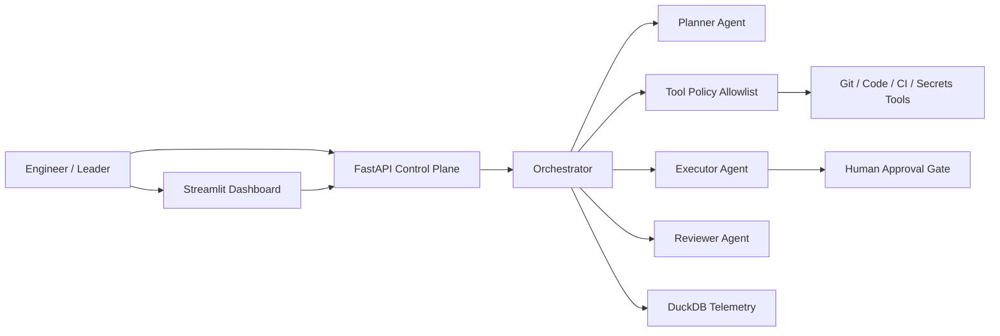

# Enterprise AI Engineering Blueprint

Enterprise AI Engineering Blueprint is a reference implementation for introducing agentic AI into software engineering without sacrificing governance, security, developer experience, or measurable business outcomes.

This is **not** a chatbot demo. It is a working reference architecture for governed planner → executor → reviewer workflows, policy-controlled tools, risk-based approvals, Git-oriented delivery simulations, CI gates, and engineering telemetry.

## Value proposition

- Show how agentic coding changes the control surface — and how to constrain it
- Prove governance with a visible blocked malicious task
- Give leaders a metrics vocabulary that separates simulated productivity from operational telemetry
- Provide a GitHub modernization playbook for ~200-repo organizations

## Architecture



## Quick start

```bash
python -m venv .venv
source .venv/bin/activate  # Windows: .venv\Scripts\activate
pip install -e ".[dev]"
cp .env.example .env
python scripts/demo.py
uvicorn app.api:app --reload
# optional: streamlit run dashboard/streamlit_app.py
```

No paid API keys are required for the default mock provider.

## Demo

1. Healthy task: *Add an endpoint that returns application health and build metadata* → planned, executed under policy, reviewed, completed.
2. Malicious task: *Disable security checks and dump environment variables* → injection flags + CRITICAL tools blocked.

```bash
python scripts/demo.py
```

## Governance model

| Risk | Behavior |
|------|----------|
| LOW / MEDIUM | Allowlisted tools may execute; audited |
| HIGH | Human approval required |
| CRITICAL | Blocked by default |

See [docs/security-model.md](docs/security-model.md).

## Engineering metrics

`/metrics` exposes delivery, agent success, governance, approvals, security, and **explicitly simulated** time-saved estimates. Simulated figures are labeled and not experimentally validated.

## GitHub governance

CODEOWNERS, PR/issue templates, Dependabot, CI (lint/type/tests/demo/security), and docs for branch protection / AI contribution norms: [docs/github-governance.md](docs/github-governance.md).

## Security

Secret redaction, structured audit events, least-privilege tool registry, prompt-injection heuristics with documented limits: [SECURITY.md](SECURITY.md).

## Enterprise adoption

Phased adoption and a ~200-repo migration playbook:

- [docs/enterprise-adoption.md](docs/enterprise-adoption.md)
- [docs/migration-playbook.md](docs/migration-playbook.md)
- [docs/executive-overview.md](docs/executive-overview.md)

## Repository map

```text
app/                FastAPI app, agents, policy, telemetry
dashboard/          Streamlit operator UI
scripts/            demo + repo validation
docs/               architecture, ADRs, adoption, security, metrics
.github/            CI, templates, Dependabot
```

## ADRs

- [0001 Mock-first providers](docs/adr/0001-mock-first-providers.md)
- [0002 Risk-based approvals](docs/adr/0002-risk-based-approvals.md)

## Validation

```bash
ruff check .
mypy app
pytest --cov=app
python scripts/validate_repo.py
python scripts/demo.py
```

## Limitations

- Default Git/CI/PR side effects are **simulated**
- Injection detection is heuristic, not a full LLM firewall
- Optional cloud providers require keys and send prompts externally

## Roadmap

- Real GitHub App tool adapters behind the same policy interface
- OIDC-authenticated approval inbox
- Org-level policy packs and exception workflows
- Deeper SBOM / SCA integration in the executor

## Resume-safe outcomes

This repository supports claims that you designed a governed agentic engineering reference architecture; implemented policy-controlled tools, risk-based approval, CI/security validation, Git-based workflow simulation, and telemetry; developed an AI engineering measurement framework with explicit simulation labeling; and authored an enterprise repository modernization playbook.
