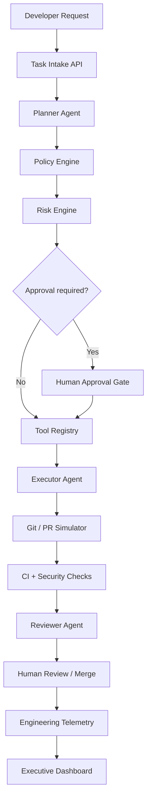

# Architecture

## Purpose

This blueprint demonstrates a **governed agentic engineering control plane**: task intake, planning, policy evaluation, risk-based approval, allowlisted tool execution, simulated Git/PR flow, CI/security signaling, telemetry, and executive metrics.

It is a reference architecture and working prototype — not a commercial product and not a production security boundary.

## Control Flow

## Components

| Component | Responsibility |
| --------- | -------------- |
| Task API | Accept requests, expose approval and event history |
| Planner Agent | Produce structured plans via provider abstraction |
| Policy Engine | Enforce allowlists, prompt guards, execution bans |
| Risk Engine | Classify LOW / MEDIUM / HIGH / CRITICAL |
| Approval Service | Pause high-risk work until human approval |
| Tool Registry | Least-privilege tool catalog from YAML |
| Executor Agent | Invoke only enabled tools; emit telemetry |
| Reviewer Agent | Evaluate tests, security, policy, residual risk |
| Telemetry Store | SQLite event + task persistence |
| Metrics | Delivery, AI, governance, simulated productivity |
| Dashboard | Streamlit KPI and trend views |

## Simulation Boundaries

The following are **simulated locally** and do not require GitHub or cloud credentials:

- Branch creation and pull request URLs
- CI/security check queuing inside tool results
- Optional OpenAI/Anthropic providers (default is `mock`)

Real enterprise integrations would replace these with GitHub Apps, OIDC workload identity, secret managers, and SOC telemetry pipelines. See `docs/security-model.md`.

## Configuration Surface

All governance behavior is configuration-driven:

- `config/tools.yaml` — tool allowlist and risk
- `config/policies.yaml` — approval and policy rules
- `config/risk_rules.yaml` — keyword risk scoring
- `config/models.yaml` — provider metadata

Agents must not hard-code privilege decisions.
